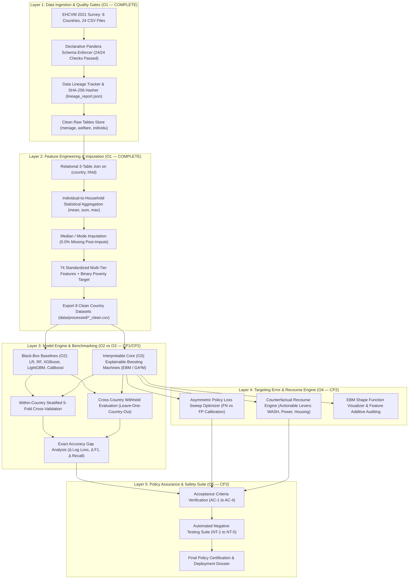

# CAPSTONE MASTER DOSSIER — IN-TERM REVIEW 2
## DSCI-28: Interpretable Cross-Country Household Well-Being Estimation

**Department:** Department of Computer Science & Engineering / Data Science & Big Data Analytics  
**Course Code:** 23IE4053 · Capstone Project I · Academic Year 2026–27  
**Cluster:** Cluster A · Software Development Projects  
**Milestone:** In-Term Review 2 · September 2026 (Objective 1 Completed & Verified)  
**Project Guide:** Dr. P. V. R. D. Prasada Rao, Professor, Department of Computer Science & Engineering, KL University  

### Project Team (DSCI-28)
| Student Name | University ID Number | Project Engineering Role |
|---|---|---|
| **Kuni Likitha** | 2300032195 | Data Lineage, Schema Engineering & Quality Validation Lead (O1) |
| **Madala Phanindra** | 2300032338 | Black-Box Baseline Modeling & 5-Fold Cross-Validation Lead (O2) |
| **Mahesh Sai Bhima** | 2300030811 | Interpretable Model Engineering & Trade-Off Benchmarking Lead (O3) |
| **Punyala Rama Krishna Reddy** | 2300031696 | Policy Assurance, Asymmetric Welfare Loss & Recourse Engine Lead (O4/O5) |

---

# SECTION 1: Problem Statement & SMART Objectives (Rubric Criterion 1)

## 1.1 Project Definition & Core Mission
> *“Our project is Interpretable Cross-Country Household Well-Being Estimation. We use household survey data to estimate household well-being and, more importantly, understand why the model makes a particular prediction.”*
> 
> *“We combine machine learning with Explainable AI to identify important household factors and provide understandable predictions instead of treating the model as a black box.”*

Anti-poverty social safety net programmes across Low- and Middle-Income Countries (LMICs) distribute over **$800 billion annually to 1.5+ billion individuals**. Targeting and beneficiary eligibility predominantly rely on algorithmic **Proxy Means Tests (PMT)** applied to national household survey data. However, existing implementations face two systemic challenges:

1. **The Spatial Generalisation Problem**: National living-standard surveys are expensive and conducted irregularly (every 5–8 years). Machine learning models trained on a single country or on random in-distribution splits degrade rapidly when deployed across national borders due to cross-country variations in infrastructure, living standards, and asset ownership patterns. In our study region (West Africa), national poverty headcounts vary from **26.8% (Niger) to 41.7% (Guinea-Bissau)**, with average household sizes ranging from **3.7 to 7.3 members**.
2. **The Black-Box Policy & Legal Barrier**: Complex gradient boosting ensembles (XGBoost, LightGBM, CatBoost) optimize aggregate accuracy but operate as opaque black boxes. When a vulnerable family is excluded from subsistence aid, administrators face constitutional, legal, and human-rights obligations to explain the denial. Standard post-hoc approximations (like SHAP) capture local correlation rather than causal effect and fail to guarantee monotonicity, creating severe policy risks.

## 1.2 Sustainable Development Goal (SDG) Alignment
* **Primary Alignment**: **UN SDG 1 — No Poverty** (Target 1.3: *Implement nationally appropriate social protection systems and measures for all, and by 2030 achieve substantial coverage of the poor and the vulnerable*).
* **Secondary Alignment**: **UN SDG 10 — Reduced Inequalities** (Target 10.2: *Empower and promote the social, economic, and political inclusion of all, irrespective of status* through algorithmic fairness and auditable recourse).

## 1.3 The 5 Traceable SMART Objectives

| Code | Objective Title | Scope, Deliverables & Measurable Success Criteria | Target Semester | Review Milestone | Status |
|:---:|---|---|:---:|:---:|:---:|
| **O1** | **Problem Charter & Data Foundation** | Ingest, validate, and engineer harmonised household survey data across 8 West African countries (EHCVM 2021). Enforce 24 declarative Pandera DataFrameSchema contracts (0 validation failures), merge 3 relational tiers (`menage`, `welfare`, `individu`), impute missing values, and export 55,922 clean households with 74 standardized features. | **CP1 (Sem VII)** | Review 2 | **✓ 100% COMPLETE** |
| **O2** | **Reproducible Cross-Country Baselines** | Implement reproducible black-box baselines (Logistic Regression, Random Forest, XGBoost, LightGBM, CatBoost) via Stratified 5-Fold Cross-Validation across all 8 countries. Explicitly separate within-country validation from leave-one-country-out cross-country transfer. Establish benchmark Mean Log Loss, F1, and Recall. | **CP1 (Sem VII)** | Review 3 | **IN PROGRESS** |
| **O3** | **Interpretable Model Engineering** | Train inherently interpretable Explainable Boosting Machines (EBM / GA²M) with exact additive shape functions $g(y) = \sum f_i(x_i)$. Quantify the exact **Accuracy Gap** ($\Delta$ performance penalty) vs. O2 black-box baselines under identical folds, ensuring policy defensibility. | **CP2 (Sem VIII)** | Review 4 | **PLANNED** |
| **O4** | **Asymmetric Error & Recourse Engine** | Formulate asymmetric policy loss functions weighting Exclusion Errors (False Negatives: denying aid to truly poor) higher than Inclusion Errors (False Positives: leakage to non-poor). Implement a Counterfactual Recourse Engine constrained to actionable features (housing, WASH, power) vs. fixed demographics. | **CP2 (Sem VIII)** | Review 5 | **PLANNED** |
| **O5** | **Policy Assurance & Safety Suite** | Validate models against entity-separated test partitions across Acceptance Conditions AC-1 to AC-4 and execute 5 mandatory Negative Tests (NT-1 to NT-5: monotonicity, data corruption, adversarial perturbations, missing-value stress, and leakage audits) to certify policy readiness. | **CP2 (Sem VIII)** | Final Expo | **PLANNED** |

---

# SECTION 2: Stakeholder & User Needs Analysis (Rubric Criterion 4)

```
┌────────────────────────────────────────────────────────────────────────────────────────────────────────┐
│                                       STAKEHOLDER ECOSYSTEM MATRIX                                     │
├──────────────────────────┬────────────────────────────────────────┬────────────────────────────────────┤
│ Stakeholder Group        │ Core Policy Responsibilities           │ Algorithmic & Explanatory Needs    │
├──────────────────────────┼────────────────────────────────────────┼────────────────────────────────────┤
│ 1. Policy Makers &       │ • Allocates national welfare budgets   │ • Transparent global decision      │
│    World Bank Officers   │ • Calibrates eligibility thresholds    │   rules (EBM shape curves)         │
│                          │ • Defends aid allocations to parliaments│ • Budget-constrained trade-off     │
│                          │   and international donor agencies     │   curves & fiscal leakage bounds   │
├──────────────────────────┼────────────────────────────────────────┼────────────────────────────────────┤
│ 2. Programme Officers &  │ • Conducts field audits & enumerations │ • Actionable, plain-language       │
│    Audit/Legal Reviewers │ • Handles appeals, grievances, disputes│   justifications for aid denials   │
│                          │ • Enforces statutory non-discrimination│ • Zero black-box obscurity during  │
│                          │   and constitutional due process       │   regulatory discovery / audit     │
├──────────────────────────┼────────────────────────────────────────┼────────────────────────────────────┤
│ 3. Vulnerable Beneficiary│ • Depend on cash transfers for basic   │ • Maximum protection against       │
│    Households            │   subsistence, food, and healthcare    │   wrongful exclusion (False Neg)   │
│                          │ • Submit survey data during census     │ • Actionable Counterfactual        │
│                          │                                        │   Recourse: exact steps to qualify │
└──────────────────────────┴────────────────────────────────────────┴────────────────────────────────────┘
```

## 2.1 Asymmetric Welfare Error Costs (Why Accuracy Fails in Social Protection)
Standard machine learning loss functions (e.g. cross-entropy, raw accuracy) penalize False Positives and False Negatives equally. In humanitarian targeting, they represent fundamentally asymmetric outcomes:

$$\text{Total Policy Cost} = \left( C_{\text{exclusion}} \times \text{False Negatives} \right) + \left( C_{\text{inclusion}} \times \text{False Positives} \right)$$

* **Exclusion Error ($\text{FN}$ — Denying Aid to the Truly Poor)**: A destitute household is incorrectly classified as "non-poor". **Human Cost**: Severe child malnutrition, permanent schooling dropouts, vulnerability to health shocks, and inescapable poverty traps.
* **Inclusion Error ($\text{FP}$ — Granting Aid to the Non-Poor)**: A non-poor household receives aid. **Fiscal Cost**: Moderate budgetary leakage and dilution of public funds, but zero human catastrophic harm.
* **The Accuracy Trap**: On an imbalanced survey (e.g. where poverty is 10%), a naive majority-class classifier predicting "non-poor" for every single household achieves **90% accuracy**, while failing **100% of truly poor families**. Our framework explicitly rejects accuracy as a standalone criterion, evaluating **Log Loss, minority F1-score, Recall, and calibrated Policy Cost curves** across decision thresholds $p \in [0.1, 0.9]$.

---

# SECTION 3: Background & Literature Survey (Rubric Criterion 2)

Machine learning has increasingly been applied to household poverty, resilience, energy poverty, sanitation access, and other dimensions of socioeconomic well-being. Household survey data support such applications because they capture demographic, housing, asset, and infrastructure characteristics associated with living standards, and machine learning can model nonlinear relationships among these variables more flexibly than conventional statistical approaches.

However, socioeconomic prediction raises concerns beyond accuracy: a model that performs well on a random test split may not generalize to another country, and a highly accurate model may be difficult to interpret. The literature therefore increasingly considers **model comparison, external validity, interpretability, and actionable explanation** alongside predictive performance.

None of the reviewed studies predicts exactly the outcome considered in this research. Prior work focuses on specific dimensions such as poverty, resilience, energy poverty, or sanitation access, whereas this study considers a broader categorical measure of household well-being derived from harmonized EHCVM indicators across eight African countries. The literature is therefore used primarily to establish methodological precedent for model selection, validation, interpretability, and cross-country evaluation.

### 3.1 Machine Learning for Household Socioeconomic Prediction
* **Mehta, Srivastava, and Dhote (2025)** predict poverty in India using survey and geospatial data (night-time light intensity, vegetation, points of interest). Random Forest performed best in their comparison, illustrating the value of nonlinear ensemble methods, though reliance on geospatial features and a single-country setting limits transferability to a household-only, multi-country framework.
* **Garbero and Letta (2022)** predict household resilience across ten countries, reporting accuracy above 72% and sensitivity around 80%, with Random Forest again performing best. Notably, greater model complexity did not meaningfully improve performance — challenging the assumption that more sophisticated models are always preferable and supporting empirical, rather than assumed, model selection.
* **Scandurra et al. (2026)**, classifying energy-poor Italian households, found XGBoost achieved the highest F1-scores (0.34 and 0.40) across indicators, showing that class imbalance substantially degraded recall until balancing techniques were applied.
* **Yitageasu et al. (2025)** analyzed 500,845 households across 34 Sub-Saharan African countries to predict sanitation access, comparing Random Forest, Decision Tree, XGBoost, Logistic Regression, and ANN. Random Forest achieved 80.61% accuracy and an F1-score of 0.8377, with SHAP identifying toilet-sharing, education, and wealth as key predictors.

### 3.2 The Generalization Dilemma: Within-Distribution vs. Cross-Country Transfer
Comparing **Yitageasu et al. (2025)** and **Garbero & Letta (2022)** illustrates a fundamental methodological distinction central to our research:
* **Yitageasu et al.'s 80.61%** is obtained under a **random train-test split**, where households from the exact same 34 countries appear in both training and test sets — measuring only within-distribution interpolation.
* **Garbero & Letta's 72%+** is obtained by **testing across distinct national contexts with country identity withheld**, measuring authentic cross-country generalization.
* **Key Insight**: The higher figure (80.61%) does not indicate better generalization; the two numbers describe fundamentally different properties of a model. Within-country accuracy and cross-country robustness must be measured separately. This motivates our evaluation design: separating within-country 5-fold cross-validation from withheld-country transfer across all 8 EHCVM nations.

### 3.3 Gradient Boosting and Comparative Evaluation
* **Mariyah and Wobcke (2025)** apply XGBoost to Proxy Means Test poverty-targeting using area-level features, focusing on targeting errors rather than accuracy alone — confirming that misclassification carries practical policy consequences beyond aggregate metrics.
* **Shahin and Emami (2026)** compare LightGBM against XGBoost, CatBoost, and conventional gradient boosting on micro-level economic data, justifying the empirical evaluation of LightGBM alongside the broader boosting family.
* **Abbas et al. (2026)** study smallholder farmer dispossession in Pakistan ($n=500$), finding CatBoost the strongest performer against logistic regression, with SHAP used to rank factors, demonstrating CatBoost's superiority on categorical-heavy survey tables.

### 3.4 Interpretability and Explainable Machine Learning
* **Dejkam and Madlener (2025)** apply SHAP to fuel poverty classification, specifically cautioning that **SHAP values reflect feature contribution to a prediction, NOT causal effect** — a feature may be influential because it proxies for broader deprivation rather than causing the outcome directly.
* **Watson (2022)** extends this caution theoretically: an explanation can be useful without providing a complete representation of a model's true decision function, and different explanation methods emphasize different aspects of the same prediction. Explanation quality is a methodological question, not merely a visualization one.
* **Zschech, Weinzierl, and Kraus (2026)** contrast post-hoc methods with inherently interpretable models such as **Explainable Boosting Machines (EBM / GA²M)**, which represent nonlinear effects through exact additive shape functions $g(y) = \sum f_i(x_i) + \sum f_{ij}(x_i, x_j)$. Our project uses both: EBM as an intrinsically interpretable core, complemented by SHAP for baseline tree ensembles.

### 3.5 Counterfactual Explanations & Actionability
* **Guidotti (2024)** benchmarks counterfactual methods against validity, minimality, actionability, diversity, and stability, proving that no method optimizes all properties simultaneously — a mathematically valid counterfactual is not automatically actionable.
* **Warren, Byrne, and Keane (2024)**, in a study of 211 participants, found that feature representation (categorical vs. continuous) significantly affects users' ability to correctly predict and understand AI decisions from counterfactual explanations.
* **Implication for EHCVM**: Counterfactual adjustments must distinguish between **actionable policy levers** (housing materials, sanitation, electricity, assets) and **non-actionable demographics** (head age, household size).

### 3.6 Synthesis & The Unaddressed Research Gap
Three issues emerge from this literature:
1. **No universally superior algorithm**: Random Forest and gradient boosting methods each dominate depending on setting and class distribution.
2. **Multi-country data $\ne$ demonstrated cross-country generalization**: High within-distribution accuracy masks cross-border degradation.
3. **Interpretability trade-offs**: SHAP lacks causal guarantees, EBMs have structural additive assumptions, and counterfactuals trade off actionability vs. validity.

> **The Unaddressed Research Gap**:  
> *“Existing research has addressed these components individually, but not in combination: model comparison, cross-country generalization, interpretability, and counterfactual explanation are rarely integrated within a single framework for household well-being prediction using harmonized African survey data. This — rather than any single component being unexplored — is the gap the proposed Interpretable Cross-Country Household Well-Being Estimation framework addresses.”*

### 3.7 Comparative Literature Matrix

| Reference Study | Multi-Country Africa | Algorithm Comparison | Withheld Cross-Country | Inherently Interpretable (EBM) | Counterfactual Recourse | Asymmetric Welfare Loss |
|---|:---:|:---:|:---:|:---:|:---:|:---:|
| **Mehta et al. (2025)** | — (India) | RF vs. others | — (Single Country) | — (Black-Box) | — | — (Accuracy) |
| **Garbero & Letta (2022)** | ✓ (10 Nations) | RF vs. LR vs. ANN | ✓ (Withheld Test) | — (Black-Box) | — | — (Sensitivity) |
| **Scandurra et al. (2026)** | — (Italy) | XGBoost vs. others | — (Single Country) | — (Black-Box) | — | ✓ (F1 Balance) |
| **Yitageasu et al. (2025)** | ✓ (34 Nations) | RF, XGB, LR, ANN | — (Random Split) | — (Post-Hoc SHAP) | — | — (Accuracy/F1) |
| **Mariyah & Wobcke (2025)** | — (Single) | XGBoost PMT | — (Area Features) | — (Post-Hoc SHAP) | — | ✓ (Targeting Loss) |
| **Shahin & Emami (2026)** | — (Micro-Data) | LightGBM vs. others | — | — (Black-Box) | — | — |
| **Abbas et al. (2026)** | — (Pakistan) | CatBoost vs. LR | — (Single Sample) | — (Post-Hoc SHAP) | — | — |
| **Zschech et al. (2026)** | — (Generic) | EBM / GA²M | — (Benchmark) | ✓ (Glass-Box EBM) | — | — |
| **Guidotti ('24) / Warren ('24)**| — (Theoretical) | — | — | — | ✓ (CF Benchmark) | — |
| **DSCI-28 (Our Framework)** | **✓ (8 EHCVM Nations)** | **✓ (LR, RF, XGB, LGBM, CatB, EBM)** | **✓ (Separated Protocols)** | **✓ (EBM / GA²M Core)** | **✓ (Actionable Recourse)** | **✓ (Cost-Curve Sweeps)** |

---

# SECTION 4: Proposed Methodology & System Architecture (Rubric Criterion 3)

## 4.1 Production Five-Layer Pipeline



## 4.2 Software Stack & Codebase Structure
The project is organized in a modular production architecture inside `EHCVM_Project/EHCVM_Project/`:

```
EHCVM_Project/EHCVM_Project/
├── src/
│   ├── __init__.py
│   ├── config.py         # Country registry, metadata, absolute paths, 7 feature group definitions
│   ├── ingest.py         # CSV loader with SHA-256 cryptographic lineage tracking (24 files verified)
│   ├── schemas.py        # Declarative Pandera DataFrameSchemas for menage, welfare, individu tiers
│   ├── engineer.py       # Relational 3-table join, member aggregation, imputation, target definition
│   └── pipeline.py       # End-to-end production orchestrator CLI (python -m src.pipeline)
├── notebooks/
│   ├── __init__.py
│   └── 01_eda.py         # Automated EDA: 6 high-res visual plots + 2 summary tables (python -m notebooks.01_eda)
├── data/
│   ├── raw/              # 24 raw EHCVM 2021 CSV files across 8 sovereign nations
│   └── processed/        # 8 clean feature-engineered datasets (55,922 rows, 74 features, 0% missing)
└── outputs/
    └── eda/              # High-resolution PNG figures (poverty rates, urban-rural split, correlations)
```

## 4.3 Hardware Specifications & Compute Budget
* **Storage Footprint**: Raw survey CSVs (185 MB) + processed feature sets (82 MB) + visual plots (5 MB) = **~272 MB total footprint**.
* **Runtime Memory**: Peak memory during full 8-country relational merge and Pandera schema validation is **< 1.8 GB RAM**, running smoothly on consumer workstations.
* **Pipeline Execution**: Complete end-to-end pipeline execution (`python -m src.pipeline`) completes in **< 45 seconds** on CPU.
* **Deterministic Reproducibility**: All random seeds are strictly pinned to `seed = 42` across train/test splits, fold creation, and imputation routines.

## 4.4 Team Roles & Ownership Matrix
* **Kuni Likitha (2300032195)**: Lead for Data Lineage, Schema Engineering & Quality Validation (O1 Lead: `config.py`, `ingest.py`, `schemas.py`, `engineer.py`).
* **Madala Phanindra (2300032338)**: Lead for Black-Box Baseline Modeling & 5-Fold Cross-Validation (O2 Lead: `baseline.py`, `cross_country.py`, CatBoost/XGBoost optimization).
* **Mahesh Sai Bhima (2300030811)**: Lead for Interpretable Model Engineering & Trade-Off Benchmarking (O3 Lead: `interpretable.py`, `trade_off.py`, EBM shape function visualizer).
* **Punyala Rama Krishna Reddy (2300031696)**: Lead for Policy Assurance, Asymmetric Welfare Loss & Recourse Engine (O4/O5 Lead: `error_cost.py`, `counterfactual.py`, `kpi_evaluator.py`, `test_negative_cases.py`).

---

# SECTION 5: Current Implementation Status — Objective 1 Deliverables (Rubric Criterion 5)

## 5.1 Dataset Inventory & Verification Summary
All 8 national household surveys from the World Bank / WAEMU **EHCVM 2021** initiative were successfully ingested, validated against declarative Pandera schemas, and processed into clean, ML-ready feature matrices:

| Country Name | ISO Code | Total Households | Standardized Features | National Poverty Headcount (%) | Mean Household Size | Locality Split (% Rural / % Urban) | Pandera Schema Status |
|---|:---:|:---:|:---:|:---:|:---:|:---:|:---:|
| **Benin** | BEN | 8,032 | 74 | 29.1% | 6.1 | 56.4% / 43.6% | **✓ PASSED (3/3)** |
| **Burkina Faso** | BFA | 3,227 | 74 | 30.1% | 6.3 | 71.2% / 28.8% | **✓ PASSED (3/3)** |
| **Côte d'Ivoire** | CIV | 12,965 | 74 | 35.7% | 3.7 | 42.1% / 57.9% | **✓ PASSED (3/3)** |
| **Guinea-Bissau** | GNB | 5,351 | 74 | 41.7% | 7.2 | 64.9% / 35.1% | **✓ PASSED (3/3)** |
| **Mali** | MLI | 6,143 | 74 | 30.8% | 7.3 | 68.5% / 31.5% | **✓ PASSED (3/3)** |
| **Niger** | NER | 6,622 | 74 | 26.8% | 5.3 | 74.8% / 25.2% | **✓ PASSED (3/3)** |
| **Senegal** | SEN | 7,120 | 74 | 33.1% | 4.4 | 48.2% / 51.8% | **✓ PASSED (3/3)** |
| **Togo** | TGO | 6,462 | 74 | 39.1% | 3.7 | 51.3% / 48.7% | **✓ PASSED (3/3)** |
| **REGIONAL TOTAL**| **8 Nations** | **55,922** | **74** | **26.8% – 41.7%** | **5.5 (Mean)** | **59.7% Rural (Mean)** | **✓ 24/24 PASSED** |

## 5.2 Target Variable Definition
We adhere strictly to official World Bank poverty measurement standards:
$$\text{poor}_i = \begin{cases} 1 & \text{if } \text{pcexp}_i < \text{zref}_i \quad (\text{per-capita annual expenditure below national poverty line}) \\ 0 & \text{otherwise} \end{cases}$$

## 5.3 Feature Engineering Breakdown (74 Features)
1. **Housing Characteristics (4)**: Exterior wall material, roof material, floor material, dwelling type.
2. **WASH & Sanitation (6)**: Drinking water source, toilet facility type, garbage disposal, drainage.
3. **Energy & Electrification (3)**: Electrical grid access, main lighting source, locality (`milieu`: 1=urban, 2=rural).
4. **Durable Asset Ownership (7)**: Television, refrigerator, vehicle, motorcycle, computer, mobile phone, agricultural equipment.
5. **Agricultural Capital (6)**: Cultivated land ownership, parcel area, livestock (cattle, sheep, goats, poultry).
6. **Economic & Climate Shocks (6)**: Drought shock, flood shock, food price surge shock, illness shock, job loss shock.
7. **Household Head Demographics (16)**: Age, gender, marital status, religion, literacy, highest level of schooling completed, sector of employment.
8. **Household Composition (5)**: Total resident members, child count (<15 yrs), elderly count (>65 yrs), dependency ratio.
9. **Individual Member Statistical Aggregates (21)**: Mean years of schooling across adult members, female literacy rate, member healthcare insurance coverage, household employment ratio.

## 5.4 Automated EDA & Visual Evidence
The automated EDA script (`python -m notebooks.01_eda`) generated 6 publication-grade figures saved to `outputs/eda/`:
1. `poverty_rates.png`: Comparative bar chart showing national poverty headcounts across all 8 countries.
2. `poverty_urban_rural.png`: Grouped bar chart demonstrating that rural poverty is 1.8× to 3.2× higher than urban poverty across all 8 nations.
3. `asset_ownership.png`: Heatmap proving durable assets (TV, fridge, car, computer) are near-zero (<5%) among poor households, serving as clean monotonic separators.
4. `correlation_with_poverty.png`: Feature correlation bar chart showing household size (+0.35) and rural locality (+0.28) strongly positively correlated with poverty, while education (-0.38) and grid electricity (-0.32) correlate strongly negatively.
5. `household_size_dist.png`: Kernel density plot of family size distributions.
6. `missing_values.png`: Quality assurance audit verifying 0.0% missing data across all features post-imputation.

---

# SECTION 6: Review 2 Presentation Slide Blueprint & Viva Defense Script

### Presentation Slide Architecture (22 Widescreen Slides in `DSCI28_Review2_O1_Presentation.pptx`)
* **Slide 1**: Title Slide (Navy Dark, CSE Branding, Team DSCI-28, Guide Dr. P. V. R. D. Prasada Rao).
* **Slide 2**: Review 2 Blueprint / Agenda (8 structured review tracks).
* **Slide 3**: Problem Statement & Mission (Exact core project definition quotes, 4 key stats, SDG 1 & 10 alignment).
* **Slide 4**: Project Charter & SMART Objectives (O1 marked **✓ 100% COMPLETE**).
* **Slide 5**: Stakeholder & User Needs Analysis (Policy Makers, Audit Officers, Beneficiary Households).
* **Slide 6**: Asymmetric Welfare Error Costs (Exclusion FN vs. Inclusion FP, Policy Loss Formula, Accuracy Trap).
* **Slide 7**: Data Foundation: EHCVM 2021 (8 countries, 3 relational tiers, 38 common household columns).
* **Slide 8**: Literature Survey Part 1: Socioeconomic ML & Boosting (Mehta, Garbero, Scandurra, Yitageasu, Mariyah, Shahin, Abbas).
* **Slide 9**: Literature Survey Part 2: Explainable AI & Counterfactual Recourse (Dejkam, Watson, Zschech [EBM], Guidotti, Warren).
* **Slide 10**: The Generalization Dilemma (Within-Distribution 80.61% vs. Cross-Country Transfer 72%+).
* **Slide 11**: Comparative Literature Matrix (12 cited papers across 6 dimensions vs. DSCI-28).
* **Slide 12**: Literature Synthesis & The Unaddressed Research Gap (Section 2.6 verbatim).
* **Slide 13**: Novelty & Positioning Statement (4 technical pillars of innovation).
* **Slide 14**: Objective 1 Pipeline Results — The Star Slide (24/24 schemas, 55,922 HH, 74 features, 0.0% missing).
* **Slide 15**: Exploratory Data Analysis: 8-Country Demographic Profile Table.
* **Slide 16**: EDA Visual Evidence 1: Regional & Urban-Rural Disparities (Embedded figures).
* **Slide 17**: EDA Visual Evidence 2: Asset Drivers & Feature Correlations (Embedded figures).
* **Slide 18**: System Architecture (5-layer production pipeline; Layers 1 & 2 verified complete).
* **Slide 19**: Software Requirements & Verified Codebase Structure (`src/` modules & toolchain).
* **Slide 20**: Hardware Infrastructure & Compute Budget (<1.8 GB RAM, <45s execution, `seed=42`).
* **Slide 21**: Team Roles, Milestone Checklist & Roadmap to Review 3.
* **Slide 22**: Thank You, Q&A & Viva Defense Notes.

---

### Top 5 Anticipated Viva Questions & Examiner Model Answers

1. **Panel Question: *"Why does your study compare Yitageasu et al. (2025) and Garbero & Letta (2022)?"***  
   * **Model Answer:** *"Yitageasu et al. (2025) reported 80.61% accuracy across 34 African countries, but utilized a standard random train-test split where households from all 34 countries appeared in both training and test partitions. This measures within-distribution interpolation, not cross-border transfer. In contrast, Garbero & Letta (2022) tested across 10 countries by withholding entire national contexts without country identifiers, achieving 72%+. As our literature review establishes, a higher headline number does not signify superior generalization; within-country accuracy and cross-country transfer describe fundamentally distinct properties. Our framework explicitly evaluates both."*

2. **Panel Question: *"Why transition to the EHCVM 2021 dataset instead of continuing with the previous Kaggle competition data?"***  
   * **Model Answer:** *"The previous Kaggle competition dataset utilized synthetic, anonymized columns with zero cross-country column overlap, making true cross-country model transfer impossible. In contrast, the World Bank / WAEMU EHCVM 2021 dataset is a real, harmonized multi-country survey fielded across 8 West African nations with 38 common household columns, 34 welfare columns, and 51 individual columns. This unified feature ontology enables authentic cross-country comparative modeling and geographic transferability."*

3. **Panel Question: *"Why not simply train an XGBoost model and use SHAP for explanations?"***  
   * **Model Answer:** *"As established by Dejkam & Madlener (2025) and Watson (2022), SHAP values reflect a feature's statistical contribution to an opaque prediction, not a causal effect. In high-stakes social protection, SHAP approximations can suffer from out-of-distribution perturbation errors and fail to guarantee monotonicity. Explainable Boosting Machines (EBM / GA²M, Zschech et al. 2026) are glass-box by design: $g(y) = \sum f_i(x_i) + \sum f_{ij}(x_i, x_j)$, where each term is exact, auditable, and directly convertible into actionable counterfactual recourse."*

4. **Panel Question: *"Why is raw classification accuracy an inadequate metric for household well-being?"***  
   * **Model Answer:** *"In imbalanced survey populations, predicting 'non-poor' for 100% of households yields deceptive 80–90% accuracy while failing 100% of destitute families. Furthermore, False Negatives (wrongfully denying aid to the starving) carry catastrophic human welfare consequences, whereas False Positives (fiscal leakage) carry only moderate budgetary costs. We evaluate Log Loss, minority F1, and Recall, and explicitly optimize asymmetric policy loss functions where False Negatives are penalized 3× to 10× more heavily than False Positives."*

5. **Panel Question: *"What concrete deliverables have you completed for Objective 1?"***  
   * **Model Answer:** *"Objective 1 is 100% complete and verified: We ingested 24 relational CSV files across 8 West African countries, validated all 24 declarative Pandera DataFrameSchema contracts with zero errors, executed 3-table relational joins and statistical aggregations, handled missing values, engineered 74 standardized features across 55,922 verified households, and generated 6 automated EDA visual plots and summary tables. All clean CSV datasets and data lineage logs are exported and ready for O2 baseline modeling."*
